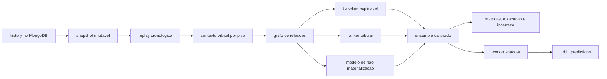

# Motor orbital

O motor orbital transforma as observacoes em hipoteses mensuraveis. Ele sempre
produz probabilidades para os 37 numeros, rankings de 9 e 12 candidatos,
explicacoes por evidencia e uma lista conservadora de exclusoes. Nesta etapa ele
opera somente em **shadow mode**: nao envia sinais ao Redis e nao executa apostas.

## Componentes

- `shared/python/roulette/orbit/`: dominio puro, tabela dos 37 numeros, relacoes,
  identificadores, construcao da orbita, grafo de evidencias, estados e score.
- `apps/signals/orbit_engine/`: snapshots, replay, baselines, features, ranker,
  sobrevivencia, calibracao, ensemble, ablacacao, treino e worker shadow.
- `apps/api/routes/orbit.py`: inspecao do cadastro numerico e analise sob demanda.
- `orbit_predictions`: colecao separada para resultados observacionais.

O `OrbitBuilder` recebe historico em ordem cronologica, do mais antigo para o
mais recente. Na decisao do instante `t`, ele usa somente dados conhecidos ate
`t`; os numeros `t+1...t+h` sao reservados exclusivamente como alvos do replay.
No painel operacional, o motor monta em paralelo a orbita do ultimo, penultimo e
antepenultimo resultado, limitada a 6 ocorrencias anteriores por pivo. Os tres
rankings sao consolidados por Borda ponderada, com pesos de recencia 1,00, 0,85
e 0,70. Assim, os tres pivos votam no ranking final sem misturar diretamente
escalas internas de energia diferentes.

## Ranking e exclusao

O baseline de regras propaga evidencia direta e, com amortecimento, em ate dois
saltos. O estado de cada candidato registra fontes independentes, relacoes,
energia, reforcos nos dois lados do pivo e idade da ativacao. O ranker aprende
pesos tabulares por candidato sem materializar todo o dataset em memoria. O
modelo de sobrevivencia estima a chance de cada candidato aparecer no horizonte.
Como a camada de regras ainda nao possui evidencia prospectiva de calibracao, ela
marca toda saida como abstencao, mesmo mantendo o ranking para estudo.

O consenso de tres pivos tambem e observacional: ele fornece Top 9, Top 12,
quantidade de apoio entre os tres rankings e a ordem completa dos 37 numeros,
mas nao transforma o ranking em promessa de vantagem estatistica ou sinal de
aposta.

## Telemetria por tentativa

O worker do servidor congela cada consenso e acompanha os dez giros seguintes.
A taxa da tentativa `k` e cumulativa: uma previsao conta como acerto quando o
primeiro numero coberto aparece entre as tentativas 1 e `k`. Apenas janelas com
dez resultados observados entram no denominador. Os recortes temporais e a
sugestao de melhor horario sao calculados no servidor a partir desses registros,
sem recalcular previsoes depois de conhecido o resultado.

Uma exclusao nao significa impossibilidade. A camada de regras isolada nunca
exclui; somente o ensemble calibrado pode emitir essa hipotese de baixa
probabilidade, emitida apenas quando o limite superior entre componentes fica
abaixo do limiar configurado. Sua metrica principal e `exclusion_leak_rate`: a
frequencia com que um numero excluido aparece no horizonte.

## Limite tecnico

Historico amplo permite medir efeitos pequenos, mas nao prova que exista um
algoritmo previsivel. Uma roleta independente pode gerar sequencias, alternancias
e correlacoes convincentes por acaso. Por isso toda regra precisa superar
baselines fora da amostra, sobreviver a ablacacao e repetir o resultado em blocos
temporais posteriores antes de ser considerada informativa.
